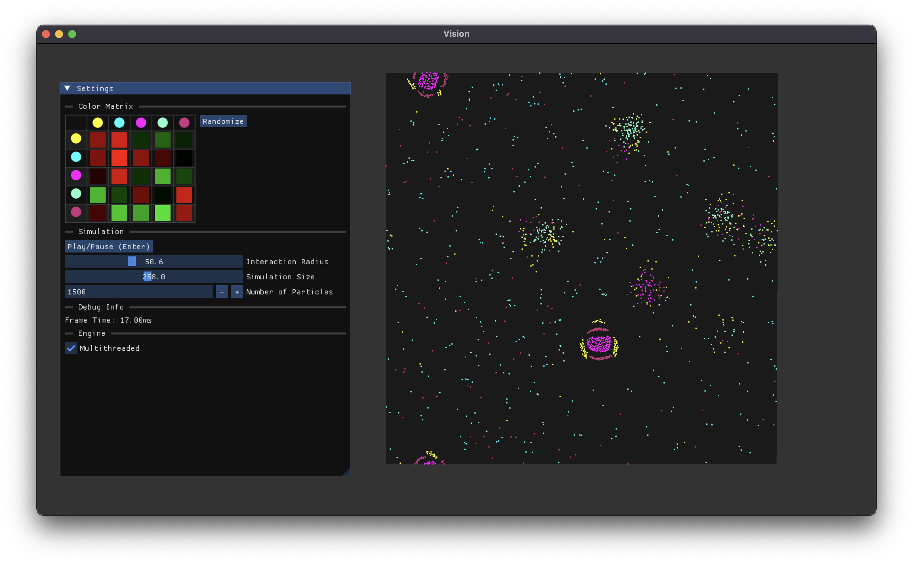

# Vision

Vision is a powerful rendering engine that supports Metal and OpenGL out of the box. The API lends a large amount of
control to the programmer, and does all of the heavy lifting to interop between the two APIs. Vision's exposed API sits somewhere between modern rendering APIs and OpenGL, using a pipeline based approach to keep state changes to a minimum, but still making efficient decisions to perform with its OpenGL renderer. The engine includes a powerful GLSL shader parser to allow for many shader programs to be written in a single file, sharing common code.

### Features

* OpenGL/Metal Render Pipeline
* Shader Cross Compilation
* Powerful Compute Pipeline and GLSL Shader Parser
* Mesh Generation for Cubes and Planes
* Shader-Antialiased Performant 2D Renderer
* Immediate Mode GUI Rendering (via ImGui)

### Goals

* WebGPU Renderer
* 2D Animation Engine
* Video Encoding
* Sphere Mesh Generation
* Shader Materials
* Lua Scripting

### Why Vision?

With so many different tools to build projects in, it's a fair question to ask. I'm building vision for a few different reasons. I don't mind reinventing the wheel. The best way to learn is to rediscover, and Vision is a tool for me to do exactly that. I'm not following a specific roadmap or working with a team to build a specific product, I just want to learn.

# Screenshots

